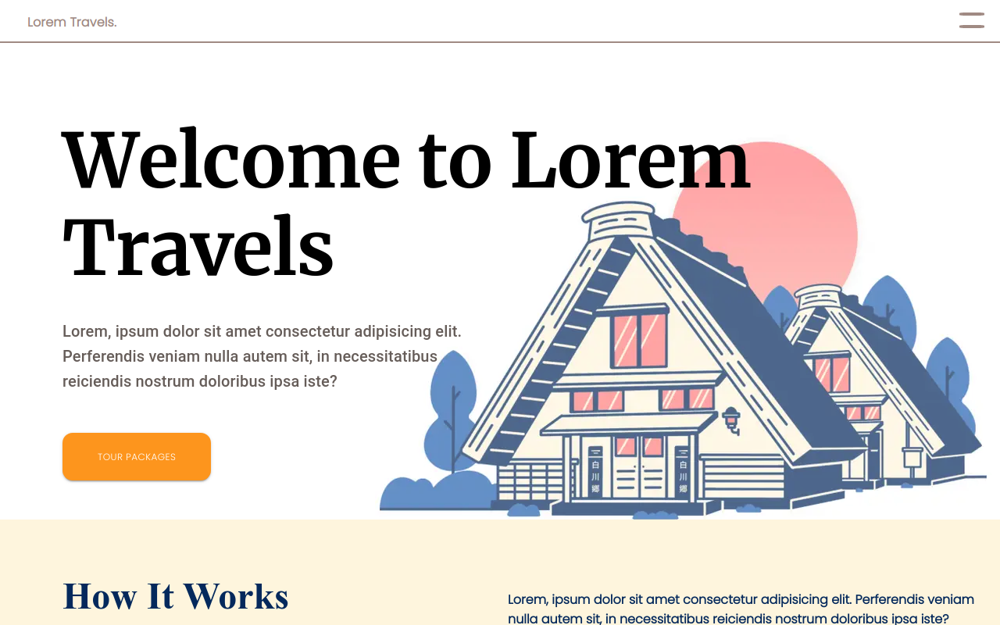
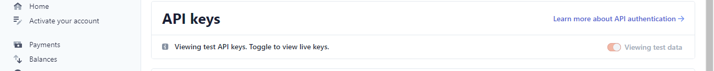
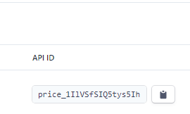

<center>
<h1>Lorem Travels</h1>
<h2>A Totally (Not) Real Travel Agency</h2>
<p>
	
	
</p>
<br />
<a href="https://lorem-travels.vercel.app/">

</a>
</center>
<br />

# About The Website

-   It is a sample travel agency website and does not refer to any particular agency and/or company in real life. Hence, the generic title **'Lorem Travels'**
-   The webapp consists of multiple pages (routes: `/` & `/pricing` as well as the routes for the different packages; following the format `/pricing/{slug}`)
-   Statically generated (_SSG_)
-   Works offline (requires the pages to be loaded before at least once, in order to facilitate browser caching)
-   Can act like an e-commerce store (payment powered by Stripe API)
-   Mobile responsive
-   Page transitions

# Technologies Used:

-   React
-   Gatsby
-   Webpack (default bundler)
-   Material-UI and styled-components
-   Stripe API
-   Cypress (for end-to-end testing)

# Installation and Running

```bash
    # To install the app:
    git clone https://github.com/AdityaBhattacharya1/lorem-travels
    cd lorem-travels-gatsby

    # To run the app:
    # If you do not have gatsby globally installed:
    npm develop

    # If you do have gatsby globally installed (preferred):
    gatsby develop
```

# Testing

```bash
    npm run test:cypress
```

# Usage

If you want to edit the data (testimonial accordion, introductory paragraphs and/or package cards):

```bash
cd .\lorem-travels-gatsby\src\components\data

# To edit intro data:
cd introData.js

# To edit accordion data:
cd accordionData.js
```

There, you will find the data in the form of a JS object. <br />
Edit the key-value pairs to obtain the desired output. <br />

<div id="pricing"></div>

## To Edit Pricing Data and Create New Pages For the Respective Packages

-   Go to the `packages` directory (path from main directory: `./lorem-travels-gatsby/src/packages`)
-   Add a new .md file (the file name does not matter)
-   Copy the data present within the double hyphens (--) from the pre made .md files (**Important step**)
-   Edit the `title`, `slug`, `desc`, `price`, `priceURL`\* and `thumb`\*\*
-   After that, leave a few lines for good measure and edit the document as you wish. Ensure that the text follows markdown syntax.
-   And, you are done. You can now find a new card on the pricing page and if you click on it, you should be redirected to a new page

(\*) **priceURL is necessary for accepting payment. Go to next section for more details about making the website into an e-commerce store** <br />
(\*\*) **What Do These Terms Mean?**

-   [slug](https://developer.mozilla.org/en-US/docs/Glossary/Slug)
-   `thumb` refers to the thumbnail or image which is displayed on the cards as well as the respective package website. **Adding the URL to the image is required, or you might incur an error.**

## To Use E-Commerce Functionalities

To add your own products and be able to accept payment via Stripe API, follow these steps: <br />

-   Make an account on Stripe and fill in the necessary details. Then, activate your account.
-   Go to Developers > API Keys, turn on live data and copy the publishable key (for safety reasons, try to avoid the secret key)
<center>
    
</center>

-   Go to [Checkout settings](https://dashboard.stripe.com/settings/checkout) and enable `Checkout client-only integration`
-   In the root of the folder `.\lorem-travels-gatsby\` create a `.env` file.
-   Follow this format in your .env file:

```sh
.env file
---------


SUCCESS_URL="https://lorem-travels.vercel.app"
CANCEL_URL="https://lorem-travels.vercel.app/pricing"

```

-   Go to `./lorem-travels-gatsby/src/utils/stripejs.js` and enter your own publishable key (from step 2) like this:

```js
const getStripe = () => {
	if (!stripePromise) {
		stripePromise = loadStripe('<YOUR PUBLISHABLE API KEY>')
	}
	return stripePromise
}
```

-   Remember about the priceURL in the `packages` folder? Go to [products page](https://dashboard.stripe.com/test/products) and create packages corresponding to the different packages (which were previously created [here](#pricing))

-   Now, go to the `.md` files of the packages and fill in the priceURL with the API ID of the respective packages
<center>
    
</center>
-   The website is now ready to accept purchases for the packages.

# Live Demo

[Website is up and running, hosted at Vercel.](https://lorem-travels.vercel.app/)

# Credit

## Hero page design

-   Inspired by _Agum Satria Prakoso_ - [Link to original design on Dribbble](https://dribbble.com/shots/15306311-Travel-Agency-Web-Exploration-Kuyjalan)

## Images

-   _Unsplash_ - [Unsplash](https://unsplash.com)

# License: MIT

MIT License

Copyright (c) 2021 Aditya Bhattacharya

Permission is hereby granted, free of charge, to any person obtaining a copy
of this software and associated documentation files (the "Software"), to deal
in the Software without restriction, including without limitation the rights
to use, copy, modify, merge, publish, distribute, sublicense, and/or sell
copies of the Software, and to permit persons to whom the Software is
furnished to do so, subject to the following conditions:

The above copyright notice and this permission notice shall be included in all
copies or substantial portions of the Software.

THE SOFTWARE IS PROVIDED "AS IS", WITHOUT WARRANTY OF ANY KIND, EXPRESS OR
IMPLIED, INCLUDING BUT NOT LIMITED TO THE WARRANTIES OF MERCHANTABILITY,
FITNESS FOR A PARTICULAR PURPOSE AND NONINFRINGEMENT. IN NO EVENT SHALL THE
AUTHORS OR COPYRIGHT HOLDERS BE LIABLE FOR ANY CLAIM, DAMAGES OR OTHER
LIABILITY, WHETHER IN AN ACTION OF CONTRACT, TORT OR OTHERWISE, ARISING FROM,
OUT OF OR IN CONNECTION WITH THE SOFTWARE OR THE USE OR OTHER DEALINGS IN THE
SOFTWARE.
