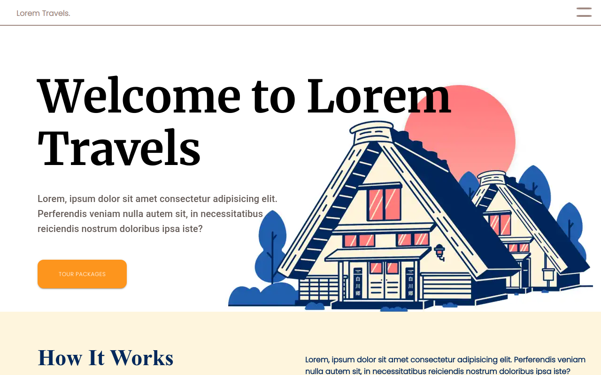

<center>
<h1>Lorem Travels</h1>
<h2>A Totally (Not) Real Travel Agency</h2>
<br />
<a href="https://lorem-travels.vercel.app/">

</a>
</center>
<br />

# About The Website

-   It is a sample travel agency website and does not refer to any particular agency and/or company in real life. Hence, the generic title **'Lorem Travels'**
-   The webapp consists of 2 pages (routes: `/` & `/pricing`)
-   Statically generated (_SSG_)
-   Works Offline (requires the pages to be loaded before at least once, in order to facilitate browser caching)
-   Mobile Responsive

# Tech Stack:

-   React
-   Gatsby
-   Webpack (default bundler)
-   Material-UI and styled-components

# Installation and Running

```
    // To install the app:
    git clone https://github.com/AdityaBhattacharya1/lorem-travels
    cd lorem-travels-gatsby

    // To run the app:
    // If you do not have gatsby globally installed:
    npm develop

    // If you do have gatsby globally installed (preferred):
    gatsby develop
```

# Usage

If you want to edit the data (testimonial accordion, introductory paragraphs and/or package cards):

```
cd .\lorem-travels-gatsby\src\components\data

// To edit intro data:
cd introData.js

// To edit pricing data:
cd pricingData.js

// To edit accordion data:
cd accordionData.js
```

There, you will find the data in the form of a JS object. <br />
Edit the key-value pairs to obtain the desired output. <br />

# Live Demo

[Website is up and running, hosted at Vercel.](https://lorem-travels.vercel.app/)

# Credit

## Hero page design

-   _Agum Satria Prakoso_ - [Link to original design on Dribbble](https://dribbble.com/shots/15306311-Travel-Agency-Web-Exploration-Kuyjalan)

## Images

-   _Unsplash_ - [Unsplash](https://unsplash.com)

# License: MIT

MIT License

Copyright (c) 2021 Aditya Bhattacharya

Permission is hereby granted, free of charge, to any person obtaining a copy
of this software and associated documentation files (the "Software"), to deal
in the Software without restriction, including without limitation the rights
to use, copy, modify, merge, publish, distribute, sublicense, and/or sell
copies of the Software, and to permit persons to whom the Software is
furnished to do so, subject to the following conditions:

The above copyright notice and this permission notice shall be included in all
copies or substantial portions of the Software.

THE SOFTWARE IS PROVIDED "AS IS", WITHOUT WARRANTY OF ANY KIND, EXPRESS OR
IMPLIED, INCLUDING BUT NOT LIMITED TO THE WARRANTIES OF MERCHANTABILITY,
FITNESS FOR A PARTICULAR PURPOSE AND NONINFRINGEMENT. IN NO EVENT SHALL THE
AUTHORS OR COPYRIGHT HOLDERS BE LIABLE FOR ANY CLAIM, DAMAGES OR OTHER
LIABILITY, WHETHER IN AN ACTION OF CONTRACT, TORT OR OTHERWISE, ARISING FROM,
OUT OF OR IN CONNECTION WITH THE SOFTWARE OR THE USE OR OTHER DEALINGS IN THE
SOFTWARE.
